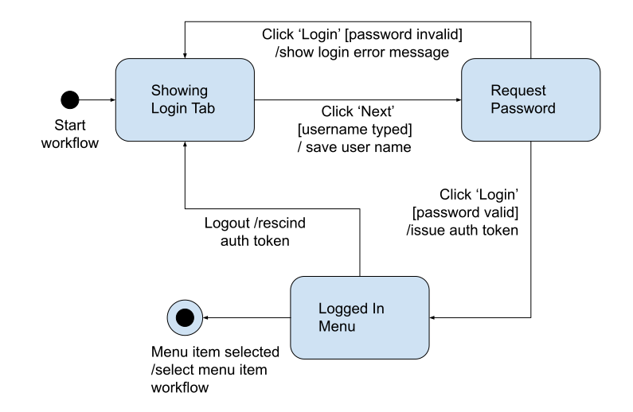

# FsmWorkFlow - A Blazor workflow component
FsmWorkFlow is a Blazor component suite that enables the creation of a workflow. A workflow is made up of a sequence of steps, each of which displays content in the component such as a group of form fields for example. The user navigates from step to step, either by clicking controls in the step body, or by clicking on headers.

The component contains a sequence of headers, one header for each step in the workflow. Each header is numbered and contains a caption. The currently active step in the workflow has its header highlighted so that the user can see which step they have reached in the workflow.

Although there is a default expected sequence the user is expected to follow when working through the workflow, sometimes it might be permitted for the user to jump back to previous steps, or to skip over future steps, depending on what data they have entered or what options they have selected in the controls on each step. The workflow component has been designed so that it highlights the headers for those steps navigable from the current active step, and grays out those headers that cannot be selected.

Because the navigational model is not linear, the actual set of workflow steps is implemented as a finite state machine. To understand how this works, we shall look at an example.

## A login workflow
The picture below represents a three-step workflow implementing a login process.

The states in the diagram are represented by the round-cornered boxes. Each state represents a period of time in which the workflow is displaying a particular tab page of form controls or other content. Unless the user does something, like clicking a button for example, the workflow component will stay in that state until such an event happens.

A transition from one state to another is represented by an arrow joining the two states showing the direction of navigation. In order for a transition to be taken, and event must be fired. The labels on the arrows denote the events that fire.

For example, while resting in the 'Showing login tab' state, the 'Click next' event may cause a transition to the 'Request password' state.

When resting in a state, if an event is fired the event may also carry a guard condition. The guard condition must evaluate to 'true' for the transition to take place. Guard conditions on the picture are represented by text in square brackets. For example, if in the 'Showing login tab' state and the 'Click next' event occurs, the transition will only be taken if the username has been typed.

Each time a transition takes place, some action can be taken by the component. The programmer can plug in a function to be executed that will be called when the transition takes place. On the diagram, actions are denoted by text after a forward slash character. For example, if resting in the 'Request password' state and the 'Click login' event occurs, provided the password is valid the action taken is to issue an authentication token.
